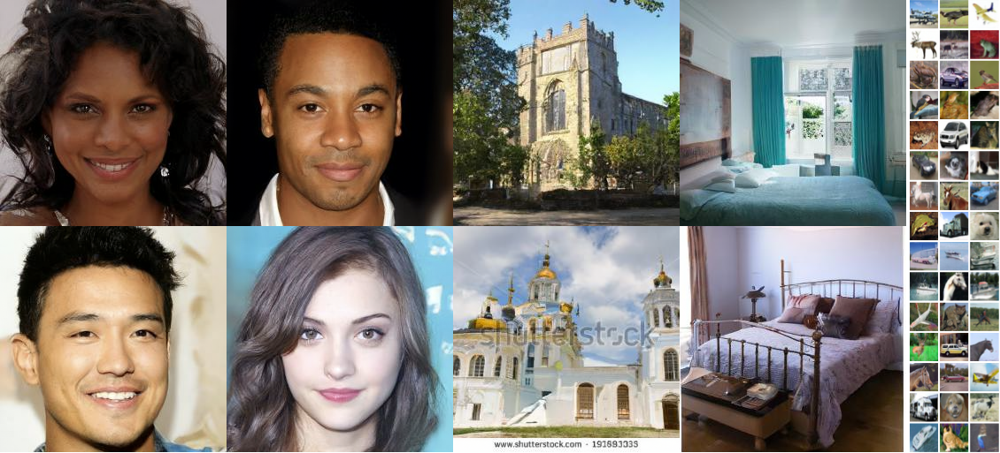

# Denoising Diffusion Probabilistic Models

Jonathan Ho, Ajay Jain, Pieter Abbeel

Paper: https://arxiv.org/abs/2006.11239

Website: https://hojonathanho.github.io/diffusion



PyTorch reimplementation for local GPU/CPU training.
Install dependencies (see `requirements.txt`) and run the training scripts in `scripts/`.

Example commands:
```
python3 scripts/run_cifar.py train --data_dir data --exp_name cifar_ddpm
python3 scripts/run_cifar.py sample --checkpoint checkpoints/cifar_ddpm/step_10000.pt

python3 scripts/run_lsun.py train --data_dir /path/to/lsun --dataset lsun_church --exp_name lsun_church_ddpm
python3 scripts/run_celebahq.py train --data_dir /path/to/celebahq --exp_name celebahq_ddpm
```

Notes:
- CIFAR-10 is downloaded automatically into `data_dir`.
- LSUN uses torchvision's dataset structure under `data_dir`.
- CelebA-HQ (or other custom image folders) should be placed in an ImageFolder-compatible directory.

Models and samples can be found at: https://www.dropbox.com/sh/pm6tn31da21yrx4/AABWKZnBzIROmDjGxpB6vn6Ja

## Citation
If you find our work relevant to your research, please cite:
```
@article{ho2020denoising,
    title={Denoising Diffusion Probabilistic Models},
    author={Jonathan Ho and Ajay Jain and Pieter Abbeel},
    year={2020},
    journal={arXiv preprint arxiv:2006.11239}
}
```
